# DBT Daily Diary Card

[Mindlogger](https://mindlogger.org/) applet for Dialectical Behavorial Therapy daily diary card.

## Image Attribution
Here are the images used in the applet, as well as the images used in the process of creating them. Images without source images to the left were created from scratch. 

| Applet Image                                                 | Image 1 | Image 2 | Image 3 | Image 4 |
|:------------------------------------------------------------:|:--------------:|:--------------:|:--------------:|:--------------:|
| 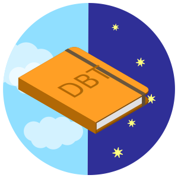 Applet Loadout |  [source](https://www.flaticon.com/free-icon/journal-book_413841?term=journal&page=1&position=50) |  [source](https://www.flaticon.com/free-icon/cloudy_334572?term=cloudy&page=5&position=38)  |  |  |
| 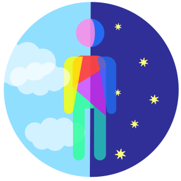 Emotions over the day | 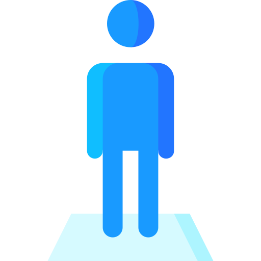 [source](https://www.flaticon.com/premium-icon/person_1916751?term=person&page=1&position=91) |   [source](https://www.flaticon.com/free-icon/cloudy_334572?term=cloudy&page=5&position=38)    |                |                |
|  Happiness |         |                |                |                |
| 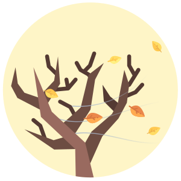 Sadness | 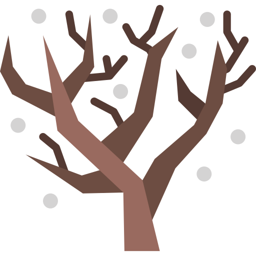 [source](https://www.flaticon.com/free-icon/tree_642021?term=winter%20tree&page=1&position=1) |  [source](https://www.flaticon.com/free-icon/leaves_616422?term=autumn%20leaf&page=1&position=22) |                |                |
| 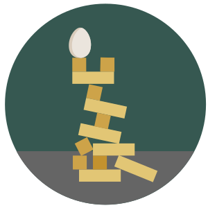 Anxiety/Fear | [source](https://www.flaticon.com/free-icon/jenga_857269?term=jenga&page=1&position=9) |  [source](https://www.flaticon.com/free-icon/egg_590794?term=egg&page=1&position=66) |                |                |
| 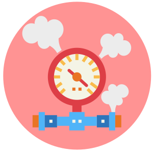 Anger | 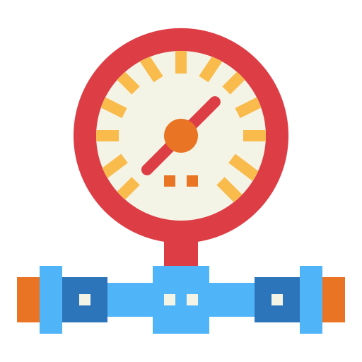 [source](https://www.flaticon.com/free-icon/pressure-gauge_2241209?term=pressure%20gauge&page=1&position=35) | 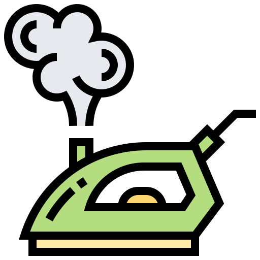 [source](https://www.flaticon.com/free-icon/steam-iron_1934893?term=steam%20iron&page=1&position=3) |                |                |
|  Shame/Guilt |  [source](https://www.flaticon.com/free-icon/bird-cage_1703143) |  [source](https://www.flaticon.com/premium-icon/tax_2168796?term=ball%20and%20chain&page=1&position=22) |                |                |
| 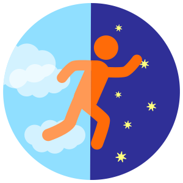 Target behaviors over the day |  [source](https://www.flaticon.com/premium-icon/runner-silhouette_46989?term=person%20running&page=1&position=12) |  [source](https://www.flaticon.com/free-icon/cloudy_334572?term=cloudy&page=5&position=38)  |                |                |
|  Mindfulness Skills |  [source](https://www.flaticon.com/free-icon/book_2490421?term=brain%20book&page=1&position=2) |                |                |                |
|  Wise Mind |    [source](https://www.flaticon.com/free-icon/think_1373027?term=think&page=1&position=50)   |                |                |                |
|  Observe: Just notice without reacting |  [source](https://www.flaticon.com/free-icon/eye_1616443?term=darius%20dan%20eye&page=1&position=27) |                |                |                |
|  Describe: Put words on/label emotion |  [source](https://www.flaticon.com/free-icon/pen_650649?term=pen&page=2&position=25) |                |                |                |
|  Participate: Enter into the experience |  [source](https://www.flaticon.com/free-icon/exercise_2723513) |                |                |                |
|  Nonjudgmental Stance |  [source](https://www.flaticon.com/free-icon/thumb-up_443354?term=thumbs%20up&page=4&position=5) |                |                |                |
|  One-mindfully in the moment |  [source](https://www.flaticon.com/free-icon/time_682048?term=clock&page=2&position=53) |                |                |                |
|  Effectiveness: Focus on what works |                |                |                |                |
|  Interpersonal Effectiveness Skills |  [source](https://www.flaticon.com/free-icon/man-hair_356172) |  [source](https://www.flaticon.com/free-icon/man-hair_356216) |                |                |
|  Objective Effectiveness (DEAR MAN) |  [source](https://www.flaticon.com/free-icon/bald-professors-talking_43168?term=person%20talking&page=1&position=78) |                |                |                |
|  Relationship Effectiveness (GIVE) |  [source](https://www.flaticon.com/free-icon/quill_183337?term=quill&page=3&position=75) | 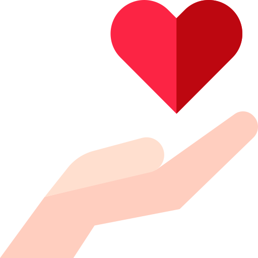 [source](https://www.flaticon.com/premium-icon/charity_2678882?term=charity&page=1&position=37) |                |                |
|  Self-respect Effectiveness (FAST) |  [source](https://www.flaticon.com/free-icon/tree_490091?term=tree&page=1&position=10) | 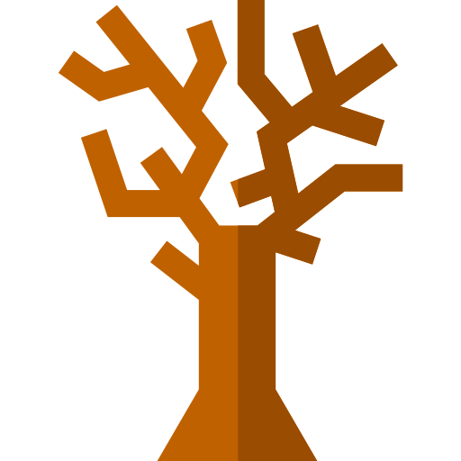 [source](https://www.flaticon.com/free-icon/tree_550199?term=tree%20branches&page=1&position=5) |                |                |
|  Dialectics |                |                |                |                |
| 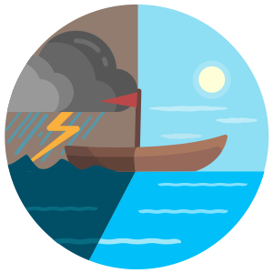 Emotion Regulation Skills |  [source](https://www.flaticon.com/free-icon/boat_475498) |  [source](https://www.flaticon.com/free-icon/storm_1146860?term=storm&page=1&position=4) |                |                |
|  Reduced Vulnerability (PLEASE) |  [source](https://www.flaticon.com/premium-icon/apple_378091?term=apple%20yellow&page=1&position=51) |                |                |                |
|  Accumulate Positive Experiences |                |                |                |                |
|  Build Mastery |  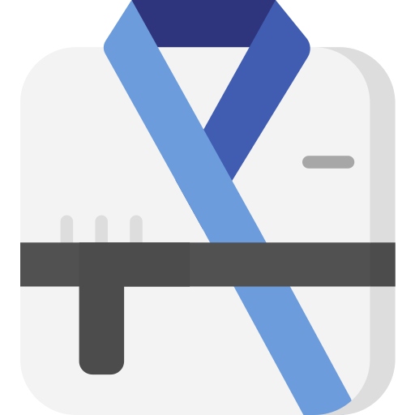 [source](https://www.flaticon.com/free-icon/kimono_1866022?term=kimono&page=2&position=88) |                |                |                |
|  Cope Ahead |    [source](https://www.flaticon.com/free-icon/telescope_1747946?term=telescope&page=4&position=31)  |                |                |                |
|  Check the Facts |  [source](https://www.flaticon.com/free-icon/research_1162914?term=research&page=1&position=60) |                |                |                |
|  Problem Solve |   [source](https://www.flaticon.com/free-icon/jigsaw_993723?term=jigsaw&page=1&position=4)   |                |                |                |
|  Opposite Action |  [source](https://www.flaticon.com/free-icon/physics_501399?term=magnet&page=1&position=58)   |                |                |                |
| 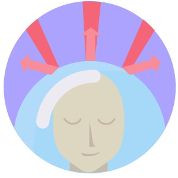 Distress Tolerance Skills |   [source](https://www.flaticon.com/free-icon/bald_356122)  |  [source](https://www.flaticon.com/premium-icon/bubbles_2652736?term=water%20bubble&page=1&position=21) |                |                |
|  STOP |         |                |                |                |
|  Distract (Wise Mind ACCEPTS) |  [source](https://www.flaticon.com/free-icon/dog_616554?term=dog&page=1&position=68)  |                |                |                |
|  Self-soothe |  [source](https://www.flaticon.com/free-icon/tub_1802512?term=bath%20tub&page=1&position=1)  |                |                |                |
|  TIPP |  [source](https://www.flaticon.com/free-icon/breath_1995895) |                |                |                |
|  IMPROVE the Moment | 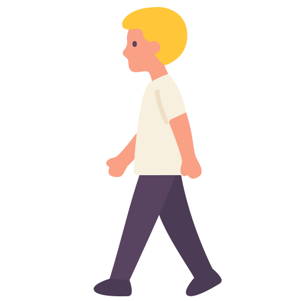 [source](https://www.flaticon.com/premium-icon/pedestrian_1993012?term=walking&page=1&position=16) |  [source](https://www.flaticon.com/free-icon/waterfall_220188?term=waterfall&page=1&position=73)  |                |                |
|  Pros and Cons |  [source](https://www.flaticon.com/premium-icon/runner-silhouette_46989?term=person%20running&page=1&position=12) |  [source](https://www.flaticon.com/free-icon/prohibited_390956?term=cancel&page=1&position=23) |                |                |
|  Radical Acceptance |  [source](https://www.flaticon.com/free-icon/leaf_424067?term=leaf&page=1&position=48) |  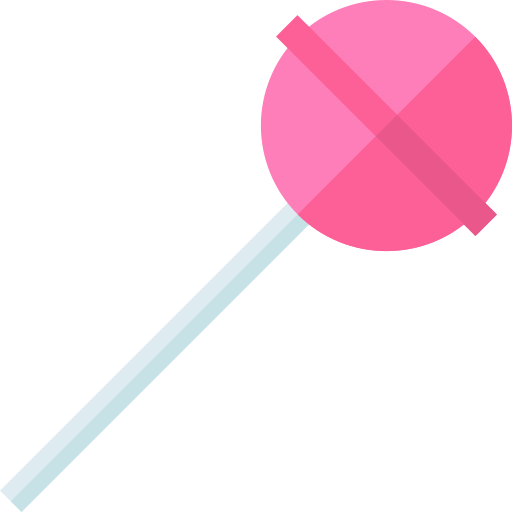 [source](https://www.flaticon.com/free-icon/lollipop_1837204?term=lollipop&page=1&position=17)  |  [source](https://www.flaticon.com/free-icon/flower_678141?term=flower&page=1&position=78)  |                |
|  What important events happened today? |   [source](https://www.flaticon.com/free-icon/calendar_2413728) |   [source](https://www.flaticon.com/premium-icon/bubbles_2652736?term=water%20bubble&page=1&position=21)  |                |                |
| 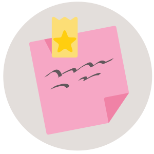 What was your goal for today? |  [source](https://www.flaticon.com/free-icon/notepad_650661?term=note&page=1&position=94) |                |                |                |
|  Did you achieve this goal? | 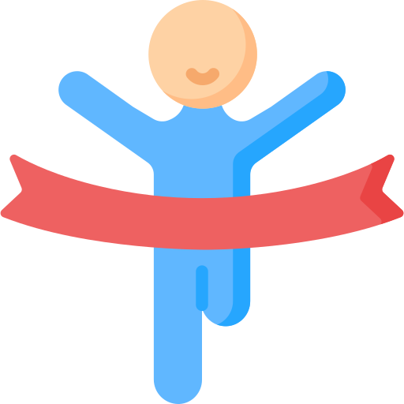 [source](https://www.flaticon.com/free-icon/winner_2618025) |                |                |                |
|  What got in the way? |  [source](https://www.flaticon.com/free-icon/question_1828837?term=question%20mark&page=1&position=56) |  [source](https://www.flaticon.com/free-icon/winner_2618025)               |                |                |
| 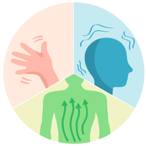 Target behavior urges |  [source](https://www.flaticon.com/premium-icon/goodbye_2201741?term=goodbye&page=1&position=2) |  [source](https://www.flaticon.com/premium-icon/mental-health_2382631?term=head&page=1&position=94) |  [source](https://www.flaticon.com/free-icon/back_2309117) |                |
| 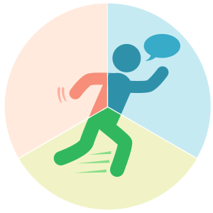 Target behavior acted |   [source](https://www.flaticon.com/premium-icon/runner-silhouette_46989?term=person%20running&page=1&position=12)   |                |                |                |

