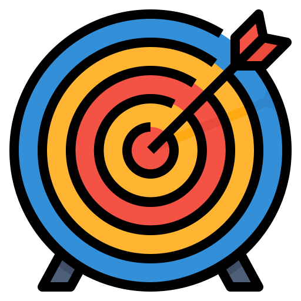

# Daily Diary Card

Add description about daily diary card

## Image Attribution and Showcase

| Applet Image                                                 | Image 1 | Image 2 | Image 3 | Image 4 |
|:------------------------------------------------------------:|:--------------:|:--------------:|:--------------:|:--------------:|
|  Applet Loadout |  source |  source  |  |  |
|  Emotions over the day |  source  |   source  |                |                |
|  Happiness |         |                |                |                |
|  Sadness |  source |  source|                |                |
|  Anxiety/Fear | source |  source |                |                |
|  Anger |  source  |  source |                |                |
|  Shame/Guilt |  source |  source  |                |                |
|  Target behaviors over the day |  source   |  source  |                |                |
|  Mindfulness Skills |  source |                |                |                |
|  Wise Mind |    source   |                |                |                |
|  Observe: Just notice without reacting |  source |                |                |                |
|  Describe: Put words on/label emotion |  source |                |                |                |
|  Participate: Enter into the experience |  source  |                |                |                |
|  Nonjudgmental Stance |  source |                |                |                |
|  One-mindfully in the moment |  source |                |                |                |
|  Effectiveness: Focus on what works |                |                |                |                |
|  Interpersonal Effectiveness Skills |  source |  source |                |                |
|  Objective Effectiveness (DEAR MAN) |  source |                |                |                |
|  Relationship Effectiveness (GIVE) |  source |  source |                |                |
|  Self-respect Effectiveness (FAST) |  source |  source |                |                |
|  Dialectics |                |                |                |                |
|  Emotion Regulation Skills |  source |  source |                |                |
|  Reduced Vulnerability (PLEASE) |  source |                |                |                |
|  Accumulate Positive Experiences |                |                |                |                |
|  Build Mastery |   source |                |                |                |
|  Cope Ahead |    source  |                |                |                |
|  Check the Facts |  source |                |                |                |
|  Problem Solve |   source   |                |                |                |
|  Opposite Action |  source   |                |                |                |
|  Distress Tolerance Skills |   source  |  source |                |                |
|  STOP |         |                |                |                |
|  Distract (Wise Mind ACCEPTS) |  source  |                |                |                |
|  Self-soothe |  source  |                |                |                |
|  TIPP |  source |                |                |                |
|  IMPROVE the Moment |  source |  source  |                |                |
|  Pros and Cons |  source |  source |                |                |
|  Radical Acceptance |  source |   source  |  source  |                |
|  What important events happened today? |   source |   source  |                |                |
|  What was your goal for today? |  source |                |                |                |
|  Did you achieve this goal? |  source |                |                |                |
|  What got in the way? |  source |                |                |                |
|  Target behavior urges |  source |                |                |                |
|  Target behavior acted |   source   |                |                |                |

### Openmoji 
Most icons in this applet directly pulled or derived from [Openmoji 12.1](https://openmoji.org/). All emojis are free to use under the CC BY-SA 4.0 license.

 

### Flaticon

Icons made by <a href="https://www.flaticon.com/authors/monkik" title="monkik">monkik</a> from <a href="https://www.flaticon.com/" title="Flaticon"> www.flaticon.com</a>

Icons made by <a href="https://www.flaticon.com/authors/freepik" title="Freepik">Freepik</a> from <a href="https://www.flaticon.com/" title="Flaticon"> www.flaticon.com</a>

